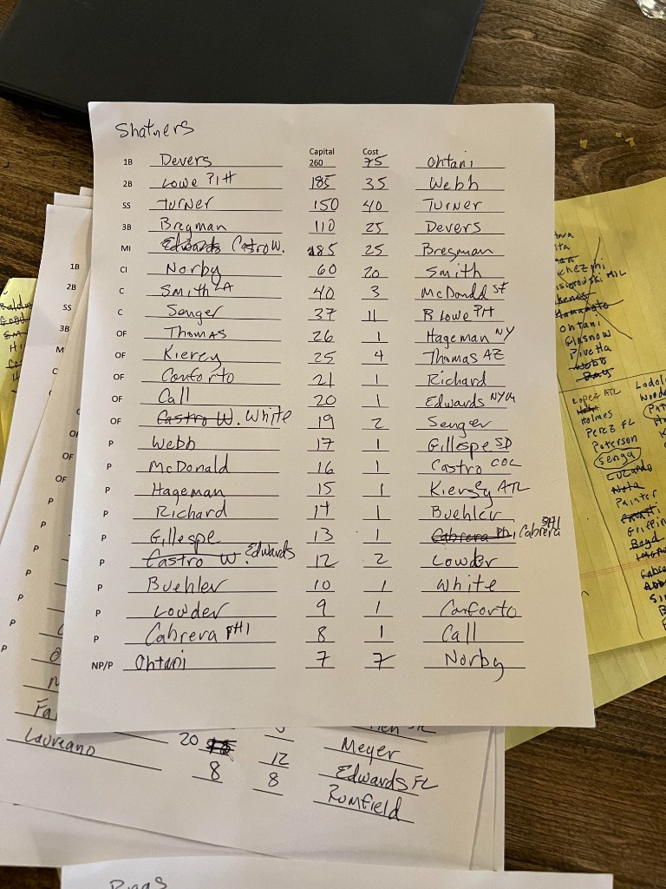

# Sidd Finch — 2026 NL auction draft

**Team:** Shatners · **Cap:** $260 · Final worksheet + pick-by-pick grades

| | |
| --- | ---: |
| **Overall draft grade** | **8/10** |
| **Avg pick score** | **7.7** |

_Source: [Sidd Finch 2026 Draft.html](Sidd%20Finch%202026%20Draft.html)_

---

## How you did

You finished **$0** remaining—full budget deployed. The roster is **star-heavy up top** (**Ohtani**, **Webb**, **Turner**) with a **massive value spike** if **Devers** truly cleared at **$25** on the host (that pick alone swings the whole auction). **Bregman** at **$25** and **Lowe** at **$11** are strong NL-only prices. You bought **catching** early-ish (**Smith $20**, **Senger $2**)—Smith is a bit more “retail” than the late $1 arms, but still a steady starter. The run of **$1–2 pitching** plus **Buehler** and **Lowder** is exactly how you survive after paying for aces. **Norby $7** for a flexible bat in **CI** is reasonable endgame. Biggest risks: **volume/IP** behind Webb, and **OF** is mostly bargains (fine for $260 math after stars).

**Pick scores (1–10)** are subjective: value vs. typical NL-only auction prices, timing, and roster need. They are not projections.

---

## Draft order, spend, and pick scores

| # | Player | Pos | Team | $ | Pick score |
|---:|---|---|:---:|---:|---:|
| 1 | Shohei Ohtani (H) | NP/P | LAD | 75 | 8 |
| 2 | Logan Webb | P | SF | 35 | 8 |
| 3 | Trea Turner | SS | PHI | 40 | 7 |
| 4 | Rafael Devers | 1B | BOS | 25 | 10 |
| 5 | Alex Bregman | 3B | CHC | 25 | 8 |
| 6 | Will Smith | C | LAD | 20 | 6 |
| 7 | Trevor McDonald | P | SF | 3 | 8 |
| 8 | Brandon Lowe | 2B | TB | 11 | 9 |
| 9 | Justin Hagenman | P | NYM | 1 | 7 |
| 10 | Lane Thomas | OF | WSH | 4 | 8 |
| 11 | Trevor Richards | P | PHI | 1 | 8 |
| 12 | Carl Edwards Jr. | MI | NYM | 1 | 6 |
| 13 | Hayden Senger | C | NYM | 2 | 10 |
| 14 | Logan Gillaspie | P | SD | 1 | 7 |
| 15 | Willi Castro | P | COL | 1 | 8 |
| 16 | DaShawn Keirsey Jr. | OF | ATL | 1 | 7 |
| 17 | Walker Buehler | P | LAD | 1 | 9 |
| 18 | Genesis Cabrera | P | PHI | 1 | 7 |
| 19 | Chase Lowder | P | CIN | 2 | 8 |
| 20 | Eli White | OF | ATL | 1 | 6 |
| 21 | Michael Conforto | OF | SF | 1 | 9 |
| 22 | Tyler Call | OF | LAD | 1 | 7 |
| 23 | Connor Norby | CI | MIA | 7 | 7 |
| **Total** | | | | **260** | **avg 7.7** |

**Sheet note:** Handwritten tag “Cabrera PHI” is interpreted as **Genesis Cabrera** (LHP); if your host card is a different Cabrera, rename in [shatners.html](shatners.html). **Lane Thomas** listed “AZ” on paper—WSH on MLB.

---

## Final roster by slot (worksheet)

| Slot | Player | $ |
| --- | --- | ---: |
| 1B | Rafael Devers | 25 |
| 2B | Brandon Lowe | 11 |
| SS | Trea Turner | 40 |
| 3B | Alex Bregman | 25 |
| MI | Carl Edwards Jr. | 1 |
| CI | Connor Norby | 7 |
| C | Will Smith | 20 |
| C | Hayden Senger | 2 |
| OF | Lane Thomas | 4 |
| OF | DaShawn Keirsey Jr. | 1 |
| OF | Michael Conforto | 1 |
| OF | Tyler Call | 1 |
| OF | Eli White | 1 |
| P | Logan Webb | 35 |
| P | Trevor McDonald | 3 |
| P | Justin Hagenman | 1 |
| P | Trevor Richards | 1 |
| P | Logan Gillaspie | 1 |
| P | Willi Castro | 1 |
| P | Walker Buehler | 1 |
| P | Chase Lowder | 2 |
| P | Genesis Cabrera | 1 |
| NP/P | Shohei Ohtani (H) | 75 |

---

## Source worksheet

_Original final draft sheet (photo)._

Working copies: [shatners.html](shatners.html) · [lightning-round.html](lightning-round.html)
