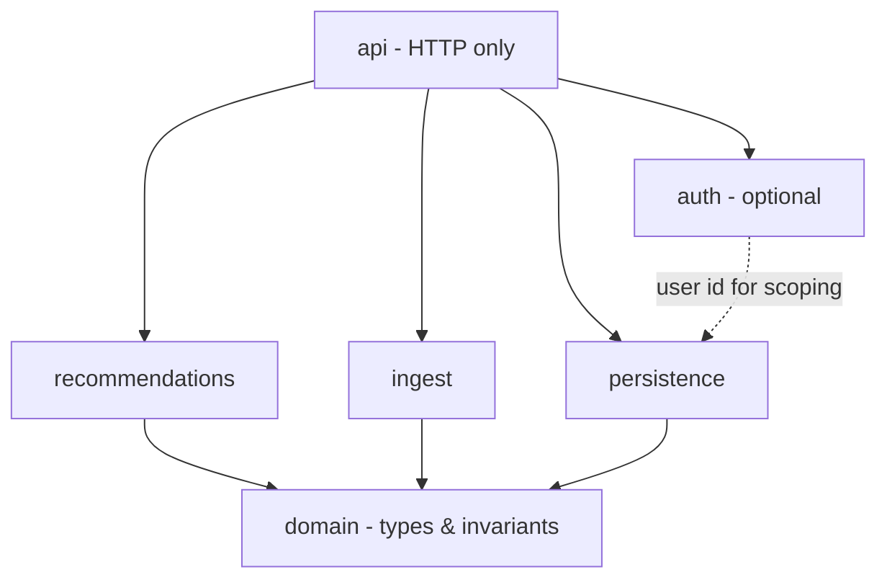
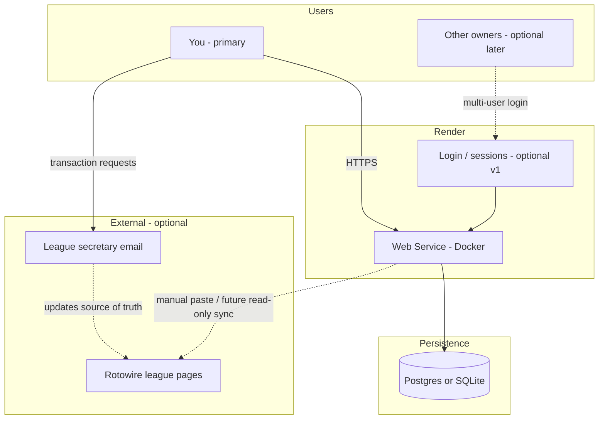
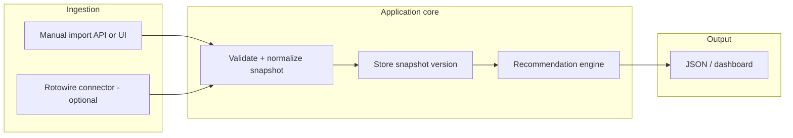
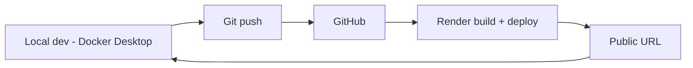

# Plan: League manager web app (Python, Docker, Render)

**Goal:** A Python web application, **containerized with Docker**, deployed on **Render**, that can eventually ingest **Rotowire league data** (read-only) and surface **recommendations** (lineup, categories, FA targets) aligned with **2026 NL league rules** (`2026/rules/2026-rules.md`).

**Primary audience:** **You only**—a personal tool for **your** team and workflow. No requirement that other managers use it.

**Future-ready:** Other league owners **might** want accounts later. The design should allow **multiple users** (sign-in, isolated data per user) without assuming everyone joins on day one.

**Design standard:** Implement and review code against **John Ousterhout**, *A Philosophy of Software Design*—see project rule **`.cursor/rules/philosophy-of-software-design.mdc`**.

**Constraints / context:**

- League operations may be **Rotowire (read)** + **email to secretary** for moves; treat Rotowire automation as **optional** and **brittle** until proven.
- Render **free web services** **spin down** when idle; first request after sleep pays a **cold start**. Plan for that in UX (loading state) or upgrade to always-on later.

---

## Objectives (phased)

| Phase | Outcome |
| --- | --- |
| **0 — Scaffold** | Repo layout, `Dockerfile`, health endpoint, `PORT` binding, local `docker compose` optional. |
| **1 — Deploy** | Git-connected **Render** deploy from Dockerfile; secrets via Render **environment**; smoke test URL. |
| **2 — Data model** | Versioned **league snapshot** (teams, rosters, category stats, standings); include **`user_id` / `team_profile_id`** columns early (nullable until auth ships) so multi-user doesn’t require a painful migration. |
| **3 — Ingest v1** | **Manual import** (paste JSON/CSV or upload) so the app works **without** Rotowire login. |
| **4 — Brain v1** | Rule-based **recommendations** from snapshot + `2026-rules.md` categories (offense: AVG, R, RBI, SB, TB+BB+HBP; pitching: W, SV, K, ERA, QS). |
| **5 — Rotowire connector (optional)** | Playwright or session-based **read-only** fetch; behind a feature flag; structured logging when HTML shifts. |
| **6 — Email (optional)** | Outbound templates / inbound parse for secretary workflow (separate from Render sleep; may use queue or external cron to ping). |
| **7 — Auth (when needed)** | Start with **single-user** (env `APP_PASSWORD` or no auth on private URL). Evolve to **multi-user**: register/login, **session cookies** or **JWT**, passwords hashed (**bcrypt** / **argon2**), **user_id** on all private rows (rosters, snapshots, email drafts). |

---

## Users and authentication (strategy)

- **v0 (solo):** One operator—you. Optional **one shared password** via env var, or rely on **obscure URL** only if you accept the risk.
- **v1 (multi-user):** **Accounts** table (`email`, `password_hash`, `display_name`). **Sessions** (server-side session store or signed JWT). Each user links to **one or more “league team” profiles** (e.g. “Shatners”) so recommendations and imports don’t mix.
- **OAuth later (optional):** Google/GitHub sign-in reduces password handling; still map OAuth identity to `user_id` and team profiles.
- **Data isolation:** Snapshots, notes, and secretary email drafts are **scoped by `user_id`** (or `team_profile_id`) so another owner never sees your FAAB targets unless you share a league-wide read-only mode by explicit choice.

---

## Technical choices (defaults)

- **Framework:** **FastAPI** + **Uvicorn** (async-friendly, OpenAPI docs, easy JSON APIs).
- **Container:** Single-stage or slim `python:3.12-slim` image; non-root user optional hardening pass.
- **Render:** **Web Service** from **Dockerfile**; set `PORT` (Render injects); command listens on `0.0.0.0`.
- **Persistence:** Start with **SQLite** in a **Render disk** (if attached) or switch early to **Render Postgres** if you need multi-instance or reliable file storage (ephemeral filesystem on free tier is a gotcha—**Postgres is safer** for production data).

---

## Software design (Ousterhout)

Apply *A Philosophy of Software Design* to this codebase—not as ceremony, but to **keep complexity from compounding**.

| Principle | How it shows up here |
| --- | --- |
| **Strategic > tactical** | Refactor when a feature would scatter special cases; don’t stack `if league == …` across layers. |
| **Deep modules** | **Narrow public API**, rich internals: e.g. one **`LeagueSnapshot`** type + **`SnapshotStore`** (load/save/version); **`RotowireReader`** (optional) hides all HTML/session mess behind `fetch_snapshot() → LeagueSnapshot` or a clear failure. |
| **Pull complexity down** | Parsing Rotowire, normalizing player IDs, and NL-only rules belong **inside** ingest/domain—not in route handlers. |
| **Different layer, different abstraction** | HTTP layer maps requests/responses only; **no pass-through** services that merely re-export the DB. |
| **Avoid temporal decomposition** | Package by **knowledge**, not pipeline step names: `domain/`, `ingest/`, `recommendations/`, `persistence/`, `api/` (or equivalent)—not `step1_load`, `step2_parse`. |
| **Information hiding** | Persist snapshots as a **versioned blob + schema version** if it reduces coupling; expose **invariants** (“snapshot is immutable per id”) in module docstrings. |
| **General mechanisms** | One **import pipeline** for manual JSON and Rotowire output; avoid duplicate validators per source. |
| **Define errors out** | Prefer validation at import boundaries so recommendation code assumes a **valid** snapshot. |
| **Comments at module level** | File/class docstrings for **why**, tradeoffs, and invariants; avoid line-by-line narration. |
| **Design it twice** | For ingest + auth boundaries, briefly sketch **two** shapes (e.g. fat adapter vs thin ORM) and pick the **lower long-term complexity** option. |

### Module layering (target dependencies)



Lower layers (`domain`) must not import `api` or FastAPI.

---

## Repository layout (target)

Organize by **domain responsibility** (Ousterhout: avoid temporal decomposition). Adjust names to taste; keep **seams** clear.

```
app/
  main.py              # app factory, mount routers only
  api/                 # HTTP: thin handlers, DTOs, deps
  domain/              # LeagueSnapshot, team, player, category keys—no FastAPI
  ingest/              # manual import, future Rotowire → domain types
  recommendations/     # pure functions / service over snapshot + rules
  persistence/         # store/load snapshots, users (later)—hide SQL details
  auth/                # optional: sessions, password verify—thin edge
data/                  # sample snapshots for dev/tests
tests/
Dockerfile
.dockerignore
requirements.txt
render.yaml            # optional: Render IaC
plans/                 # this document
.cursor/rules/         # philosophy-of-software-design.mdc (Ousterhout)
```

---

## Render + Docker checklist

1. **Dockerfile** `CMD` uses `$PORT` (e.g. `sh -c 'uvicorn ... --port ${PORT:-8000}'`).
2. **Health check** route (`/health`) for Render **health checks**.
3. **`.dockerignore`** excludes `.git`, `.venv`, `__pycache__`.
4. **Environment variables** on Render: no secrets in image; use dashboard or `render.yaml`.
5. **Cold starts:** document that first load after idle may lag; avoid long synchronous scrapes on the **first** request (use background job or manual trigger).

---

## Security notes

- **Rotowire credentials** (if ever used): env vars only; never commit; rotate if logs leak.
- **Rate limiting** on any scrape or import endpoint to avoid abuse if URL is public (stronger once **multi-user** or public signup exists).
- Prefer **read-only** automation; align with Rotowire **terms of use**.
- **Multi-user:** Never store plaintext passwords; use **HTTPS** on Render (default); consider **email verification** or **invite-only** registration if the app is discoverable.

---

## Workflow diagrams

### End-to-end system context



### Request / data flow inside the app



### Deploy loop (Git → Render)



---

## Success criteria

- **Docker:** `docker build` and `docker run -p 8000:8000` serve a healthy app locally.
- **Render:** Auto-deploy on push; `/health` returns 200; no hard-coded secrets.
- **Product:** With a **mock or pasted** league snapshot, the UI or API returns at least one **actionable recommendation** (e.g. weakest category vs league median).
- **Design:** New features **default** to new code behind **existing module boundaries**; route files stay thin; **no duplicated** league-rule logic outside `domain` / `recommendations`.

---

## Open decisions (fill in as you go)

- **Roto vs points** scoring on Rotowire (affects recommendation math).
- **Postgres vs SQLite** on Render (filesystem persistence vs managed DB).
- **Auth rollout:** ship **solo** first (env password or none), then **multi-user** (email+password or OAuth) when a second owner wants in.
- **Registration policy:** open sign-up vs **invite-only** (you create accounts or send invite links).

---

*Last updated: Ousterhout-aligned layout + Cursor rule; primary user = you; multi-user optional.*
