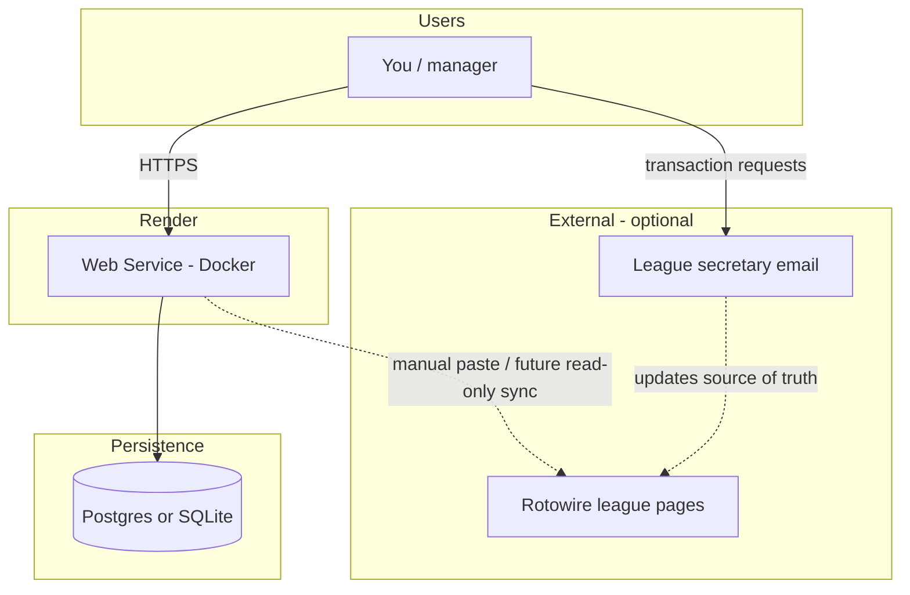
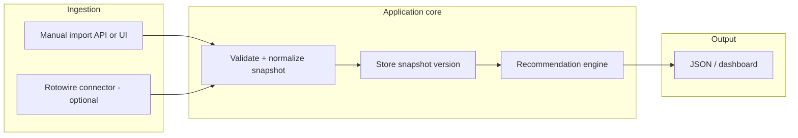
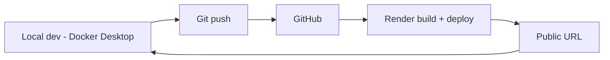

# Plan: League manager web app (Python, Docker, Render)

**Goal:** A Python web application, **containerized with Docker**, deployed on **Render**, that can eventually ingest **Rotowire league data** (read-only) and surface **recommendations** (lineup, categories, FA targets) aligned with **2026 NL league rules** (`2026/rules/2026-rules.md`).

**Constraints / context:**

- League operations may be **Rotowire (read)** + **email to secretary** for moves; treat Rotowire automation as **optional** and **brittle** until proven.
- Render **free web services** **spin down** when idle; first request after sleep pays a **cold start**. Plan for that in UX (loading state) or upgrade to always-on later.

---

## Objectives (phased)

| Phase | Outcome |
| --- | --- |
| **0 — Scaffold** | Repo layout, `Dockerfile`, health endpoint, `PORT` binding, local `docker compose` optional. |
| **1 — Deploy** | Git-connected **Render** deploy from Dockerfile; secrets via Render **environment**; smoke test URL. |
| **2 — Data model** | Versioned **league snapshot** (teams, rosters, category stats, standings); store in **SQLite** (file) or **Render Postgres** if you need durability across deploys. |
| **3 — Ingest v1** | **Manual import** (paste JSON/CSV or upload) so the app works **without** Rotowire login. |
| **4 — Brain v1** | Rule-based **recommendations** from snapshot + `2026-rules.md` categories (offense: AVG, R, RBI, SB, TB+BB+HBP; pitching: W, SV, K, ERA, QS). |
| **5 — Rotowire connector (optional)** | Playwright or session-based **read-only** fetch; behind a feature flag; structured logging when HTML shifts. |
| **6 — Email (optional)** | Outbound templates / inbound parse for secretary workflow (separate from Render sleep; may use queue or external cron to ping). |

---

## Technical choices (defaults)

- **Framework:** **FastAPI** + **Uvicorn** (async-friendly, OpenAPI docs, easy JSON APIs).
- **Container:** Single-stage or slim `python:3.12-slim` image; non-root user optional hardening pass.
- **Render:** **Web Service** from **Dockerfile**; set `PORT` (Render injects); command listens on `0.0.0.0`.
- **Persistence:** Start with **SQLite** in a **Render disk** (if attached) or switch early to **Render Postgres** if you need multi-instance or reliable file storage (ephemeral filesystem on free tier is a gotcha—**Postgres is safer** for production data).

---

## Repository layout (target)

```
app/                 # FastAPI routes, services
  main.py
  ...
data/                # optional: sample snapshots for dev
tests/
Dockerfile
.dockerignore
requirements.txt
render.yaml          # optional: Infrastructure as Code for Render
plans/               # this document
```

---

## Render + Docker checklist

1. **Dockerfile** `CMD` uses `$PORT` (e.g. `sh -c 'uvicorn ... --port ${PORT:-8000}'`).
2. **Health check** route (`/health`) for Render **health checks**.
3. **`.dockerignore`** excludes `.git`, `.venv`, `__pycache__`.
4. **Environment variables** on Render: no secrets in image; use dashboard or `render.yaml`.
5. **Cold starts:** document that first load after idle may lag; avoid long synchronous scrapes on the **first** request (use background job or manual trigger).

---

## Security notes

- **Rotowire credentials** (if ever used): env vars only; never commit; rotate if logs leak.
- **Rate limiting** on any scrape or import endpoint to avoid abuse if URL is public.
- Prefer **read-only** automation; align with Rotowire **terms of use**.

---

## Workflow diagrams

### End-to-end system context



### Request / data flow inside the app



### Deploy loop (Git → Render)



---

## Success criteria

- **Docker:** `docker build` and `docker run -p 8000:8000` serve a healthy app locally.
- **Render:** Auto-deploy on push; `/health` returns 200; no hard-coded secrets.
- **Product:** With a **mock or pasted** league snapshot, the UI or API returns at least one **actionable recommendation** (e.g. weakest category vs league median).

---

## Open decisions (fill in as you go)

- **Roto vs points** scoring on Rotowire (affects recommendation math).
- **Postgres vs SQLite** on Render (filesystem persistence vs managed DB).
- **Auth** for the dashboard (none for personal use vs simple password vs OAuth).

---

*Last updated: plan created for Render + Docker Python deployment path.*
