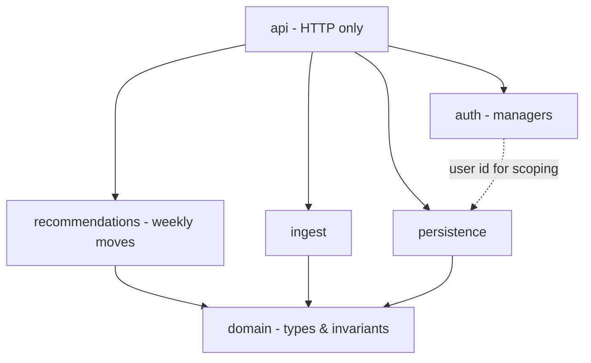
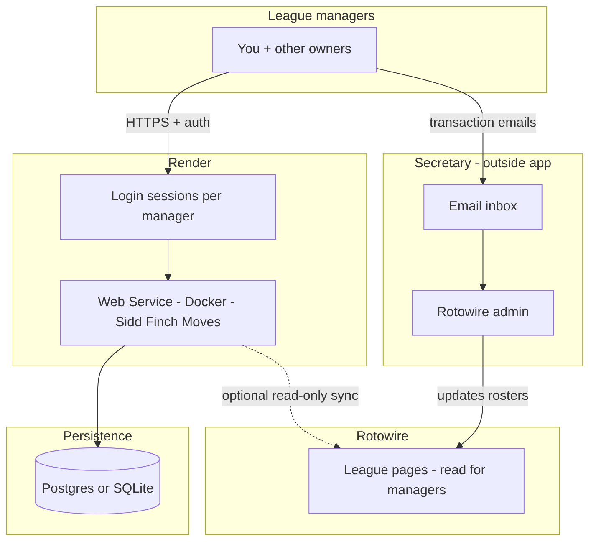
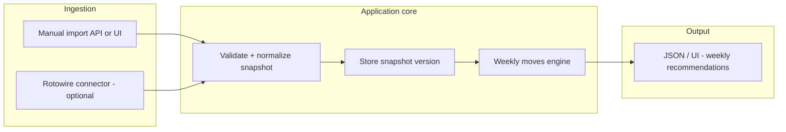
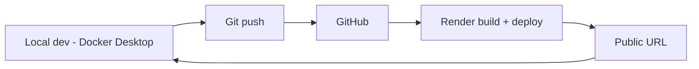

# Plan: Sidd Finch Moves (Python, Docker, Render)

**Goal:** A Python web application, **containerized with Docker**, deployed on **Render**, named **Sidd Finch Moves**. Its purpose is to deliver **weekly move recommendations** aligned with the **transaction cadence** in **2026 NL league rules** (`2026/rules/2026-rules.md`): **Monday transaction days**, **weekly free-agent bidding timeline** (public bids Mon–Thu, sealed bids Fri–Sat, resolution Sun–Mon), **$260 season transaction budget**, **standings** (including tie-break and **Rule of Four** implications), and the **available player pool** (**NL free agents** eligible to bid, **waivers** after cuts, reserve rules).

**Primary audience:** **You and every other league manager** (e.g. **11 teams** in 2026). Each manager signs in to see **their** team’s **week-scoped** guidance: what to bid, what to claim, category pressure, and budget-aware priorities—not a generic “league admin” tool.

**Non-users:** The **league secretary** does **not** use this application. The secretary continues to execute roster changes on **Rotowire** and to coordinate moves from **email** (or other league process). Managers may use the app to **draft emails** or **track requests** sent to the secretary—**outbound only** from the app’s perspective.

**Requirement:** **Multi-tenant by design** from the first shippable version: **authentication**, **per-manager data isolation**, and a clear binding between **login identity** and **league team** (e.g. Shatners, Kiev Ghosts).

**Design standard:** Implement and review code against **John Ousterhout**, *A Philosophy of Software Design*—see project rule **`.cursor/rules/philosophy-of-software-design.mdc`**.

**Constraints / context:**

- **Managers** use this app; **Rotowire** remains the league host (read automation **optional** / **brittle**). **Secretary** updates Rotowire outside the app.
- Render **free web services** **spin down** when idle; first request after sleep pays a **cold start**. Plan for that in UX (loading state) or upgrade to always-on later.

---

## Objectives (phased)

| Phase | Outcome |
| --- | --- |
| **0 — Scaffold** | Repo layout, `Dockerfile`, health endpoint, `PORT` binding, local `docker compose` optional. |
| **1 — Deploy** | Git-connected **Render** deploy from Dockerfile; secrets via Render **environment**; smoke test URL. |
| **2 — Auth (managers)** | **Invite-only:** no public registration. Commish (or delegate) **issues invites** (one-time token or magic link) per **league team**; manager **claims** invite, sets password, then uses **session cookies** or **JWT**. Passwords hashed (**bcrypt** / **argon2**). Each account is bound to **exactly one** team at invite creation. No shared “league password.” |
| **3 — Data model** | Versioned **league snapshot** (standings, rosters, budgets/spend, waiver state if modeled) and all private artifacts scoped by **`user_id` / `team_profile_id`** (required on write). League-wide **read** data (standings, published bid lists when available) stored per snapshot **version** with explicit access rules—pick one approach (shared vs per-tenant copy) and document invariants. |
| **4 — Ingest v1** | **Manual import** (paste JSON/CSV or upload) **per logged-in manager** so the app works **without** Rotowire login. Snapshot must be sufficient to compute **category gaps vs league**, **place in standings**, **remaining transaction budget**, and **available NL players** (FA list + waiver pool as provided by import). |
| **5 — Weekly brain v1** | **Recommendations engine** driven by: **`2026-rules.md`** cadence (which **day of the week** actions apply; public vs sealed vs response phases), **current standings**, **$260 budget** and spend-to-date, **scoring categories** (offense: AVG, R, RBI, SB, TB+BB+HBP; pitching: W, SV, K, ERA, QS), and **FA / waiver** candidates. Output: prioritized **weekly move list** (adds, bids, claims) with **plain-language rationale** (category need, Rule of Four if in top four, waiver priority notes when data exists). |
| **6 — Rotowire connector (optional)** | Playwright or session-based **read-only** fetch to refresh rosters, standings, and available players; **per-user Rotowire session** if each manager uses their own Rotowire login, or a single service account if league policy allows—document security implications. |
| **7 — Email helpers (optional)** | **Managers** generate **outbound** messages (e.g. FA bids, add/drop, sealed-bid emails) to the **secretary’s** address; optional **inbound** parse of **replies** to update “request status” in-app. The secretary never logs into this app. |

---

## Users and authentication (strategy)

- **Who signs in:** **League managers only** (you + other owners). **Not** the secretary.
- **Invite-only onboarding:** There is **no** self-service “create account” without a valid **invite**. Invites are **minted by an admin** (or seeded for dev) and encode (or reference) the **`team_profile_id`** so the manager cannot pick another team.
- **Accounts:** `email`, `password_hash`, `display_name`; optional **OAuth** later only if it still flows through **invite binding** (e.g. link Google after invite)—never orphan OAuth sign-up.
- **Team binding:** One **team profile** per manager, fixed at **invite acceptance**; no open team picker.
- **Authorization:** All **private** rows (imports, notes, bid drafts, per-team snapshot copies) require **`user_id`** match (or role-based admin for league-wide ops).
- **League-wide visibility:** Define explicitly what **all** managers may see (e.g. full standings, published bid threads) vs **owner-only** (sealed bid drafts, personal watchlists). Prefer **one** policy module so rules don’t sprawl (Ousterhout: general mechanism).
- **Local dev:** Use a **seed script** with 2–3 test accounts representing different teams; production uses real manager emails.

---

## Technical choices (defaults)

- **Framework:** **FastAPI** + **Uvicorn** (async-friendly, OpenAPI docs, easy JSON APIs).
- **Container:** Single-stage or slim `python:3.12-slim` image; non-root user optional hardening pass.
- **Render:** **Web Service** from **Dockerfile**; set `PORT` (Render injects); command listens on `0.0.0.0`.
- **Persistence:** Start with **SQLite** in a **Render disk** (if attached) or switch early to **Render Postgres** if you need multi-instance or reliable file storage (ephemeral filesystem on free tier is a gotcha—**Postgres is safer** for production data).

---

## Software design (Ousterhout)

Apply *A Philosophy of Software Design* to this codebase—not as ceremony, but to **keep complexity from compounding**.

| Principle | How it shows up here |
| --- | --- |
| **Strategic > tactical** | Refactor when a feature would scatter special cases; don’t stack `if league == …` across layers. |
| **Deep modules** | **Narrow public API**, rich internals: e.g. one **`LeagueSnapshot`** type + **`SnapshotStore`** (load/save/version); **`WeeklyMovesEngine`** (or equivalent) that takes snapshot + calendar “as-of” and returns **`RecommendationPack`** without callers knowing phase rules line-by-line; **`RotowireReader`** (optional) hides HTML/session mess behind `fetch_snapshot() → LeagueSnapshot` or a clear failure. |
| **Pull complexity down** | Parsing imports, NL eligibility, waiver priority rules, and **day-of-week cadence** belong **inside** `domain` / `recommendations`—not in route handlers. |
| **Different layer, different abstraction** | HTTP layer maps requests/responses only; **no pass-through** services that merely re-export the DB. |
| **Avoid temporal decomposition** | Package by **knowledge**, not pipeline step names: `domain/`, `ingest/`, `recommendations/` (weekly moves + rules), `persistence/`, `api/` (or equivalent)—not `step1_load`, `step2_parse`. |
| **Information hiding** | Persist snapshots as a **versioned blob + schema version** if it reduces coupling; expose **invariants** (“snapshot is immutable per id”; “recommendations are computed for a single `as_of` instant”) in module docstrings. |
| **General mechanisms** | One **import pipeline** for manual JSON and Rotowire output; avoid duplicate validators per source. |
| **Define errors out** | Prefer validation at import boundaries so recommendation code assumes a **valid** snapshot. |
| **Comments at module level** | File/class docstrings for **why**, tradeoffs, and invariants; avoid line-by-line narration. |
| **Design it twice** | For **weekly cadence** + auth boundaries, briefly sketch **two** shapes (e.g. explicit state machine vs date-driven policy table) and pick the **lower long-term complexity** option. |

### Module layering (target dependencies)



Lower layers (`domain`) must not import `api` or FastAPI.

---

## Repository layout (target)

Organize by **domain responsibility** (Ousterhout: avoid temporal decomposition). Adjust names to taste; keep **seams** clear.

```
app/
  main.py              # app factory, mount routers only
  api/                 # HTTP: thin handlers, DTOs, deps
  domain/              # LeagueSnapshot, team, player, categories, budget, cadence keys—no FastAPI
  ingest/              # manual import, future Rotowire → domain types
  recommendations/     # weekly moves: snapshot + rules + as_of date → ranked actions
  persistence/         # store/load snapshots, users, team profiles—hide SQL details
  auth/                # login, sessions, team binding—required for production
data/                  # sample snapshots for dev/tests
tests/
Dockerfile
.dockerignore
requirements.txt
render.yaml            # optional: Render IaC
plans/sidd-finch-moves.md  # this plan
.cursor/rules/         # philosophy-of-software-design.mdc (Ousterhout)
```

---

## Render + Docker checklist

1. **Dockerfile** `CMD` uses `$PORT` (e.g. `sh -c 'uvicorn ... --port ${PORT:-8000}'`).
2. **Health check** route (`/health`) for Render **health checks**.
3. **`.dockerignore`** excludes `.git`, `.venv`, `__pycache__`.
4. **Environment variables** on Render: no secrets in image; use dashboard or `render.yaml`.
5. **Cold starts:** document that first load after idle may lag; avoid long synchronous scrapes on the **first** request (use background job or manual trigger).

---

## Security notes

- **Rotowire credentials** (if ever used): env vars only; never commit; rotate if logs leak.
- **Rate limiting** on auth and import endpoints; **account enumeration** resistance on **login** and **invite redemption** (generic errors, no “email not found” vs “wrong password” distinction).
- Prefer **read-only** automation; align with Rotowire **terms of use**.
- **Managers:** Never store plaintext passwords; **HTTPS** on Render (default); **invite-only** is **required**—no public registration endpoint in production.

---

## Workflow diagrams

### End-to-end system context



### Request / data flow inside the app



### Deploy loop (Git → Render)



---

## Success criteria

- **Docker:** `docker build` and `docker run -p 8000:8000` serve a healthy app locally.
- **Render:** Auto-deploy on push; `/health` returns 200; no hard-coded secrets.
- **Product:** With a **mock or pasted** league snapshot and a chosen **calendar date**, the UI or API returns a **week-appropriate** set of **actionable recommendations** (e.g. FA targets under budget, waiver claims when modeled, category gaps vs standings context—not only “weakest category vs median”).
- **Multi-manager:** **Two or more** test accounts can log in concurrently; each sees **only** their team’s private data; shared league views behave per policy.
- **Invite-only:** **No** unauthenticated path creates a user; new managers onboard **only** via a **valid, unexpired invite** tied to a team.
- **Design:** New features **default** to new code behind **existing module boundaries**; route files stay thin; **no duplicated** league-rule or cadence logic outside `domain` / `recommendations`.

---

## Open decisions (fill in as you go)

- **Roto vs points** scoring on Rotowire (affects recommendation math).
- **Postgres vs SQLite** on Render (filesystem persistence vs managed DB).
- **League-wide data:** single shared snapshot vs per-tenant copy—impacts storage and consistency.
- **How much of the FA weekly thread** is machine-readable (published bid list, Thursday state) vs **manual entry** for v1.
- **Waiver queue / priority** fidelity in imports vs simplified “reverse standings” only.

---

*Last updated: product scope is **Sidd Finch Moves**—weekly recommendations from rules cadence, budgets, standings, and FA/waiver availability; invite-only auth; managers only; secretary excluded.*
