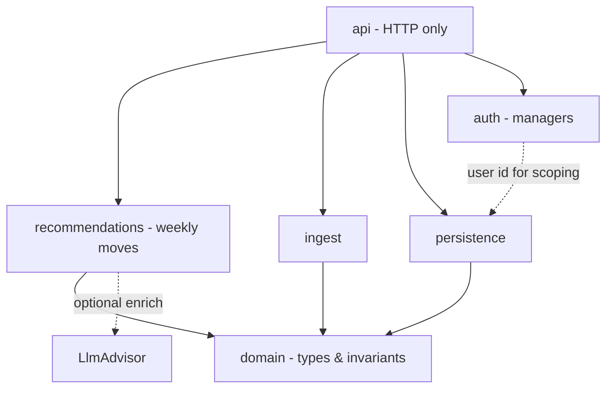
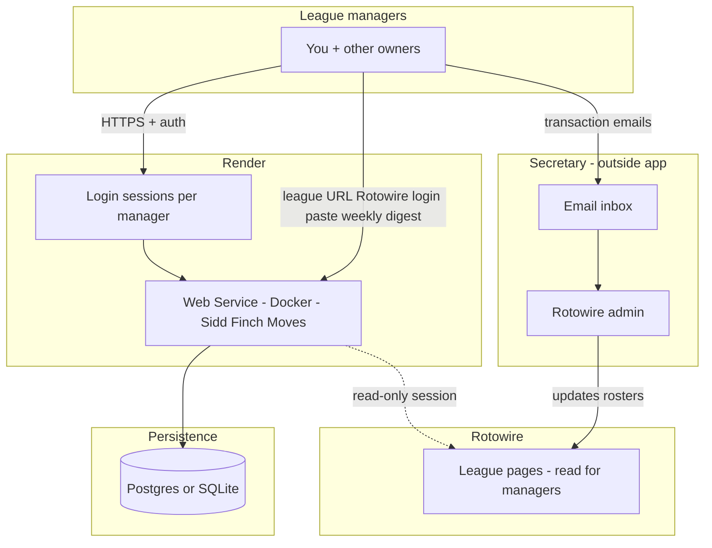
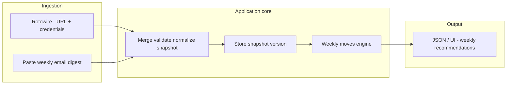
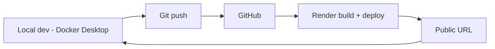

# Plan: Sidd Finch Moves (Python, Docker, Render)

**Goal:** A Python web application, **containerized with Docker**, deployed on **Render**, named **Sidd Finch Moves**. Its purpose is to deliver **weekly move recommendations** aligned with the **transaction cadence** in the [**2026 NL league rules**](https://github.com/sergehb-git/siddfinch/blob/master/2026/rules/2026-rules.md): **Monday transaction days**, **weekly free-agent bidding timeline** (public bids Mon–Thu, sealed bids Fri–Sat, resolution Sun–Mon), **$260 season transaction budget**, **standings** (including tie-break and **Rule of Four** implications), and the **available player pool** (**NL free agents** eligible to bid, **waivers** after cuts, reserve rules). **v1** combines **read-only Rotowire** fetches (after the manager supplies the **league homepage URL** and **Rotowire credentials**) with a **copy-pasted** weekly secretary **email digest** for **authoritative budgets** and the **published new-waivers list**. **Recommendations** use a **deterministic core** (rules + parsed data); an **optional LLM** may assist with **ranking and prose** only—see [Recommendations: deterministic core vs LLM](#recommendations-deterministic-core-vs-llm).

**Primary audience:** **You and every other league manager** (e.g. **11 teams** in 2026). Each manager signs in to see **their** team’s **week-scoped** guidance: what to bid, what to claim, category pressure, and budget-aware priorities—not a generic “league admin” tool.

**Non-users:** The **league secretary** does **not** use this application. The secretary continues to execute roster changes on **Rotowire** and to coordinate moves from **email** (or other league process). Managers may use the app to **draft emails** or **track requests** sent to the secretary—**outbound only** from the app’s perspective.

**Requirement:** **Multi-tenant by design** from the first shippable version: **authentication**, **per-manager data isolation**, and a clear binding between **login identity** and **league team** (e.g. Shatners, Kiev Ghosts).

**Design standard:** Implement and review code against **John Ousterhout**, *A Philosophy of Software Design*—see project rule **`.cursor/rules/philosophy-of-software-design.mdc`**.

**Constraints / context:**

- **Managers** use this app; **Rotowire** remains the league host (read automation is **brittle**—HTML changes, login flows). **Secretary** updates Rotowire outside the app.
- Render **free web services** **spin down** when idle; first request after sleep pays a **cold start**. Plan for that in UX (loading state) or upgrade to always-on later.

**v1 data sources (both used):** **v1 uses Rotowire (league URL + the manager’s Rotowire credentials) for live standings and free-agent lists, and a copy-pasted weekly league email for authoritative season budgets and the published “New Waivers” list.** Recommendations for **bids, response ceilings, and waiver claims** should treat the pair as the **minimum complete dataset**; if one side is missing, the UI may still show partial advice (e.g. FA-only from Rotowire) but must **label** budget- and waiver-dependent guidance as **incomplete** until the latest digest is pasted.

**Connecting the league (v1 UX):** After **app login**, the manager provides the **Rotowire league homepage URL** (see reference URLs below). The app parses **`leagueID`** and the **commish path** segment (e.g. `mlbcommish26`) so the same code works for other leagues with different IDs. The app then **challenges for Rotowire credentials** to establish an authenticated session for **read-only** fetches.

**Reference URLs — Sidd Finch (`leagueID=530`):** These illustrate the four pages v1 targets; other leagues substitute their own `leagueID` and path.

| Role | URL |
| --- | --- |
| League home (user-supplied; source of truth for ID/path) | `https://www.rotowire.com/mlbcommish26/league.php?leagueID=530` |
| Cumulative / live standings | `https://www.rotowire.com/mlbcommish26/standings-live.php?leagueID=530` |
| Free agent hitters (default FA list) | `https://www.rotowire.com/mlbcommish26/free-agents.php?leagueID=530` |
| Free agent pitchers | `https://www.rotowire.com/mlbcommish26/free-agents.php?leagueID=530&pos=P` |

**Weekly email digest (v1):** **Copy-paste** the secretary’s weekly message body into the app (no Gmail API in v1). The parser extracts **standings** (and Rule of Four line when present), **“New Waivers”** names, **transactions** (optional for context), and **budgets** (per team: previous total, this week, new total—the **authoritative** view of what each team has left for the season). Format changes over time: version the parser and keep **fixtures** from real samples in `data/` or tests.

---

## Objectives (phased)

| Phase | Outcome |
| --- | --- |
| **0 — Scaffold** | Repo layout, `Dockerfile`, health endpoint, `PORT` binding, local `docker compose` optional. |
| **1 — Deploy** | Git-connected **Render** deploy from Dockerfile; secrets via Render **environment**; smoke test URL. |
| **2 — Auth (managers)** | **Invite-only:** no public registration. Commish (or delegate) **issues invites** (one-time token or magic link) per **league team**; manager **claims** invite, sets password, then uses **session cookies** or **JWT**. Passwords hashed (**bcrypt** / **argon2**). Each account is bound to **exactly one** team at invite creation. No shared “league password.” |
| **3 — Data model** | Versioned **league snapshot** merging **Rotowire-derived** fields (standings, FA hitters/pitchers) with **digest-derived** fields (**budgets**, **new waivers** list). Private artifacts scoped by **`user_id` / `team_profile_id`**. Document invariants: e.g. budget numbers come **only** from the pasted digest unless you later add a second authoritative source. |
| **4 — Ingest v1** | **Rotowire:** From pasted **league home URL**, derive fetch URLs; manager supplies **Rotowire credentials**; **read-only** scrape of **standings-live** + **free-agents** (hitters) + **free-agents `pos=P`** (pitchers). **Email:** **Copy-paste** weekly secretary digest → structured extract (standings snippet, Rule of Four, new waivers, budgets). **Merge** into one normalized snapshot for the recommendation engine. **Dev fallback:** fixture JSON for tests without live Rotowire. |
| **5 — Weekly brain v1** | **Deterministic `WeeklyMovesEngine`:** cadence from [**`2026/rules/2026-rules.md`**](https://github.com/sergehb-git/siddfinch/blob/master/2026/rules/2026-rules.md) (which **day of the week**; public vs sealed vs response phases), **standings** (Rotowire and/or digest—reconcile or prefer one with explicit policy), **budgets from digest only** (never inferred by LLM), **scoring categories** (offense: AVG, R, RBI, SB, TB+BB+HBP; pitching: W, SV, K, ERA, QS), **FA lists from Rotowire**, **waiver names from digest**; **eligibility** (e.g. NL-only, Rule of Four, roster slots) and **bid caps** computed in **code**. Output: prioritized **weekly move list** with **initial FA bid** and **response bid ceiling** where rules support it, plus **waiver claim** suggestions; baseline **rationale** from structured logic. **Optional LLM layer:** re-rank within the **legal candidate set**, expand **natural-language rationale**, or polish copy—**validated** so any suggestion that violates budgets, eligibility, or procedure is **dropped or clamped**; app must run **with LLM disabled**. |
| **6 — Rotowire hardening** | Resilient login (captcha / session expiry), **adapter tests** when HTML shifts, rate limits, clear “re-auth needed” UX. Align implementation with Rotowire **terms of use** (read-only, no abuse). |
| **7 — Email helpers (optional)** | **Outbound:** managers generate FA / sealed-bid / add-drop drafts to the secretary. **Inbound (post–v1):** Gmail API or forward-to-parser—**not** required while v1 stays **copy-paste**. The secretary never logs into this app. |

---

## Users and authentication (strategy)

- **Who signs in:** **League managers only** (you + other owners). **Not** the secretary.
- **Invite-only onboarding:** There is **no** self-service “create account” without a valid **invite**. Invites are **minted by an admin** (or seeded for dev) and encode (or reference) the **`team_profile_id`** so the manager cannot pick another team.
- **Accounts:** `email`, `password_hash`, `display_name`; optional **OAuth** later only if it still flows through **invite binding** (e.g. link Google after invite)—never orphan OAuth sign-up.
- **Team binding:** One **team profile** per manager, fixed at **invite acceptance**; no open team picker.
- **Authorization:** All **private** rows (imports, notes, bid drafts, per-team snapshot copies) require **`user_id`** match (or role-based admin for league-wide ops).
- **League-wide visibility:** Define explicitly what **all** managers may see (e.g. full standings, published bid threads) vs **owner-only** (sealed bid drafts, personal watchlists). Prefer **one** policy module so rules don’t sprawl (Ousterhout: general mechanism).
- **Local dev:** Use a **seed script** with 2–3 test accounts representing different teams; production uses real manager emails.

---

## Technical choices (defaults)

- **Framework:** **FastAPI** + **Uvicorn** (async-friendly, OpenAPI docs, easy JSON APIs).
- **Container:** Single-stage or slim `python:3.12-slim` image; non-root user optional hardening pass.
- **Render:** **Web Service** from **Dockerfile**; set `PORT` (Render injects); command listens on `0.0.0.0`.
- **Persistence:** Start with **SQLite** in a **Render disk** (if attached) or switch early to **Render Postgres** if you need multi-instance or reliable file storage (ephemeral filesystem on free tier is a gotcha—**Postgres is safer** for production data).
- **LLM (optional):** If used, call a hosted or local model via **env-configured** API; keep the **deterministic engine** the default path so tests and cold-start UX do not depend on the model.

---

## Recommendations: deterministic core vs LLM

| Responsibility | **Deterministic code** (required) | **LLM** (optional) |
| --- | --- | --- |
| **Budgets** (remaining $, bid ceilings) | Parse from digest + enforce caps in code | **Do not use** for arithmetic or “what you can spend” |
| **Eligibility** (NL-only, Rule of Four, who can be bid/claimed, roster shape) | Encode from rules + snapshot in `domain` / engine | **Do not use** as authority; may **narrate** decisions already taken in code |
| **Procedure / cadence** (transaction day, FA week phase, sealed vs public) | Derive from calendar + [**rules doc**](https://github.com/sergehb-git/siddfinch/blob/master/2026/rules/2026-rules.md) in code | **Do not use** to interpret rules of procedure |
| **Who to target / ordering / “why this player”** | Rule-based ranking from category gaps + standings | **May** assist: compare candidates, pros/cons, **within** the candidate set returned by the engine |
| **Natural-language explanation** | Template strings from structured reasons | **May** rewrite or enrich, grounded on engine output |

**Contract:** The LLM receives **already-validated DTOs** (candidate players, numeric caps, flags)—not raw HTML dumps as the sole source of truth. Responses should be **structured** (e.g. JSON schema) where possible, then **re-validated** before display. **Feature flag** or env toggle: **LLM off** = full value from the deterministic pack alone.

---

## Software design (Ousterhout)

Apply *A Philosophy of Software Design* to this codebase—not as ceremony, but to **keep complexity from compounding**.

| Principle | How it shows up here |
| --- | --- |
| **Strategic > tactical** | Refactor when a feature would scatter special cases; don’t stack `if league == …` across layers. |
| **Deep modules** | **Narrow public API**, rich internals: e.g. one **`LeagueSnapshot`** type + **`SnapshotStore`** (load/save/version); **`WeeklyMovesEngine`** that takes snapshot + calendar “as-of” and returns **`RecommendationPack`** without callers knowing phase rules line-by-line; optional **`LlmAdvisor`** takes **`RecommendationPack` + legal candidates** and returns **copy / re-ordering** only after the engine; **`RotowireReader`** hides login + HTML/session mess behind a small surface (e.g. `fetch_rw_slice() → RotowireSlice`); **`DigestParser`** hides messy paste text behind `parse_digest(text) → DigestExtract` (then merge into `LeagueSnapshot`). |
| **Pull complexity down** | Parsing imports, **NL eligibility**, waiver priority rules, **day-of-week cadence**, and **budget math** belong **inside** `domain` / `recommendations` (deterministic)—**not** in the LLM prompt as the authority; **not** in route handlers. |
| **Different layer, different abstraction** | HTTP layer maps requests/responses only; **no pass-through** services that merely re-export the DB. |
| **Avoid temporal decomposition** | Package by **knowledge**, not pipeline step names: `domain/`, `ingest/`, `recommendations/` (weekly moves + rules), `persistence/`, `api/` (or equivalent)—not `step1_load`, `step2_parse`. |
| **Information hiding** | Persist snapshots as a **versioned blob + schema version** if it reduces coupling; expose **invariants** (“snapshot is immutable per id”; “recommendations are computed for a single `as_of` instant”) in module docstrings. |
| **General mechanisms** | One **merge pipeline**: Rotowire slice + digest extract → validated **`LeagueSnapshot`**; avoid duplicate “source of truth” for budget (digest only in v1). |
| **Define errors out** | Prefer validation at import boundaries so recommendation code assumes a **valid** snapshot. |
| **Comments at module level** | File/class docstrings for **why**, tradeoffs, and invariants; avoid line-by-line narration. |
| **Design it twice** | For **weekly cadence** + auth boundaries, briefly sketch **two** shapes (e.g. explicit state machine vs date-driven policy table) and pick the **lower long-term complexity** option. |

### Module layering (target dependencies)



Lower layers (`domain`) must not import `api` or FastAPI. **`LlmAdvisor`** is optional glue **downstream of** **`WeeklyMovesEngine`** inside or beside `recommendations/`; it must not be imported by `domain`.

---

## Repository layout (target)

Organize by **domain responsibility** (Ousterhout: avoid temporal decomposition). Adjust names to taste; keep **seams** clear.

```
app/
  main.py              # app factory, mount routers only
  api/                 # HTTP: thin handlers, DTOs, deps
  domain/              # LeagueSnapshot, team, player, categories, budget, cadence keys—no FastAPI
  ingest/              # Rotowire fetch + URL parse; pasted weekly digest parser; fixtures
  recommendations/     # WeeklyMovesEngine → RecommendationPack; optional LlmAdvisor (validate outputs)
  persistence/         # store/load snapshots, users, team profiles—hide SQL details
  auth/                # login, sessions, team binding—required for production
data/                  # sample snapshots for dev/tests
tests/
Dockerfile
.dockerignore
requirements.txt
render.yaml            # optional: Render IaC
plans/sidd-finch-moves.md  # this plan
.cursor/rules/         # philosophy-of-software-design.mdc (Ousterhout)
```

---

## Render + Docker checklist

1. **Dockerfile** `CMD` uses `$PORT` (e.g. `sh -c 'uvicorn ... --port ${PORT:-8000}'`).
2. **Health check** route (`/health`) for Render **health checks**.
3. **`.dockerignore`** excludes `.git`, `.venv`, `__pycache__`.
4. **Environment variables** on Render: no secrets in image; use dashboard or `render.yaml` (include **LLM API key** only if the optional advisor is enabled).
5. **Cold starts:** document that first load after idle may lag; avoid long synchronous scrapes on the **first** request (use background job or manual trigger).

---

## Security notes

- **Rotowire credentials:** Prefer **short-lived session** (cookies) over long-lived plaintext password storage; never log credentials or raw HTML containing session tokens; document rotation if a breach is suspected. Align with Rotowire **terms of use** for automated access.
- **Rate limiting** on auth and import endpoints; **account enumeration** resistance on **login** and **invite redemption** (generic errors, no “email not found” vs “wrong password” distinction).
- Prefer **read-only** automation; align with Rotowire **terms of use**.
- **Managers:** Never store plaintext passwords; **HTTPS** on Render (default); **invite-only** is **required**—no public registration endpoint in production.
- **LLM provider (if enabled):** API keys in env only; **minimize** payload sent to the vendor (prefer compact DTOs over full digest HTML); document **retention** / zero-retention settings; align with league comfort on **exporting roster data** to a third party.

---

## Workflow diagrams

### End-to-end system context



### Request / data flow inside the app



### Deploy loop (Git → Render)



---

## Success criteria

- **Docker:** `docker build` and `docker run -p 8000:8000` serve a healthy app locally.
- **Render:** Auto-deploy on push; `/health` returns 200; no hard-coded secrets.
- **Product:** With **Rotowire data** (from URL + credentials) plus a **pasted weekly digest** (budgets + new waivers) and a chosen **calendar date**, the UI or API returns a **week-appropriate** set of **actionable recommendations** (FA targets with **opening bid** and **response ceiling**, waiver claims aligned with digest list, category gaps vs standings—and explicit **incomplete** state if digest or Rotowire slice is missing).
- **Multi-manager:** **Two or more** test accounts can log in concurrently; each sees **only** their team’s private data; shared league views behave per policy.
- **Invite-only:** **No** unauthenticated path creates a user; new managers onboard **only** via a **valid, unexpired invite** tied to a team.
- **Design:** New features **default** to new code behind **existing module boundaries**; route files stay thin; **no duplicated** league-rule or cadence logic outside `domain` / `recommendations`.
- **LLM:** With LLM **disabled**, recommendations remain **correct per coded rules** (budgets, eligibility, procedure); with LLM **enabled**, UI still shows **engine numbers** as source of truth and treats model text as **assistive**.

---

## Open decisions (fill in as you go)

- **LLM:** Hosted API vs **local** model; provider; **structured output** format; default **on vs off** for new users.
- **Roto vs points** scoring on Rotowire (affects recommendation math).
- **Postgres vs SQLite** on Render (filesystem persistence vs managed DB).
- **League-wide data:** single shared snapshot vs per-tenant copy—impacts storage and consistency.
- **Standings reconciliation** when Rotowire **standings-live** and the digest **standings** block differ (timestamp skew): prefer one with explicit policy and surface the delta in UI if material.
- **FA weekly thread** (published bids Thu, sealed Fri–Sat): still **manual** or separate v2 unless scraped from elsewhere.
- **Waiver queue / priority:** digest gives **names on waivers**; full **reverse-standings priority** may still need Rotowire or rules inference—how much to automate in v1.
- **Rotowire fetch stack:** Playwright vs HTTP client + cookies (captcha / bot checks).

---

*Last updated: **v1** = Rotowire (league URL + credentials: standings + FA hitters/pitchers) + **copy-paste** weekly email (budgets + new waivers); both for complete bid/ceiling/waiver advice; Sidd Finch reference URLs for `leagueID=530`; **deterministic recommendation core** with **optional LLM** for ranking/prose only (not budgets, eligibility, or procedure); invite-only auth; managers only; secretary excluded.*
